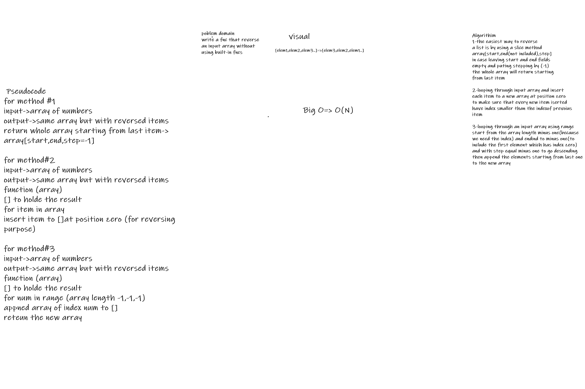
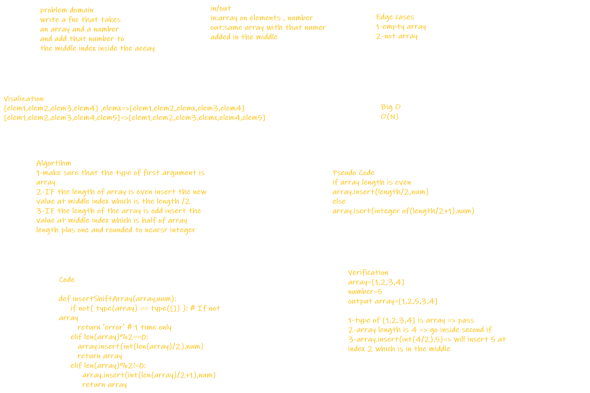
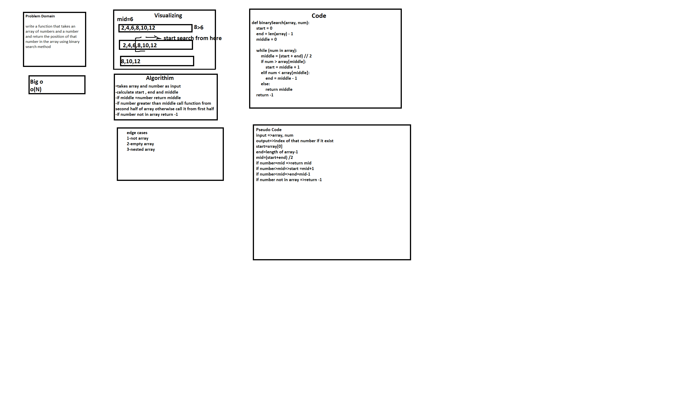

# data-structures-and-algorithms401

| Description        | Linke     | 
| -------------      |:-------------:| 
| Reverse-Array      | [reverse-array](code-challenges/array_reverse.py)  | 
|Shift_array         | [shift-array](code-challenges/shif_array.py)

## Reverse An Array
this code challenge in about making a function taking an input array and return the array with reverse order

## Whiteboard process

## Approach & Efficiency
how to reverse an array by different techniques and without using built-in functions

## Insert to Middle of an Array
function insert a value in the middle of a specific array

## Whiteboard Process

## Approach & Efficiency
logical thinking , breaking problem into steps

## Binary Search
function find the index of a number inside an array using binary search method

## whiteboard process

## Approach & Efficiency
logical thinking , breaking problem into steps

